# SignalCraft Mobile - 아키텍처 구조도

## 🏗️ 전체 아키텍처

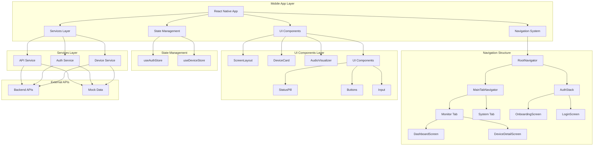

## 🏗️ 인프라 아키텍처 (Docker Compose 기반)

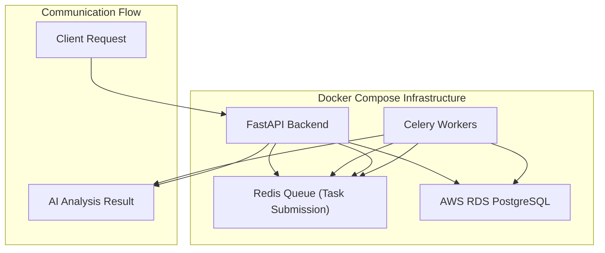

## 🔐 인증 아키텍처 (JWT 기반)

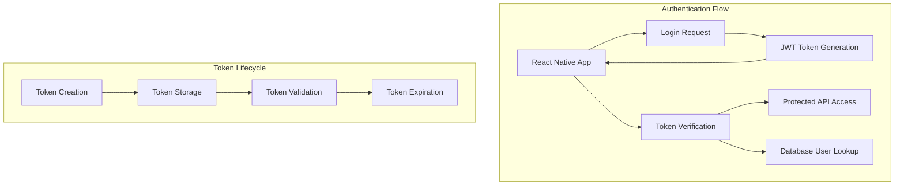

## 🔄 데이터 흐름도

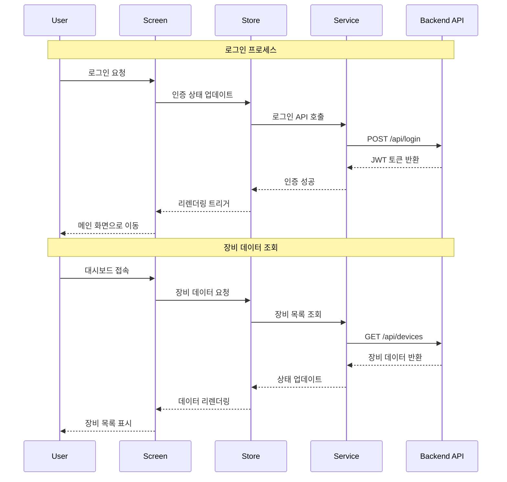

## 📱 컴포넌트 트리 구조

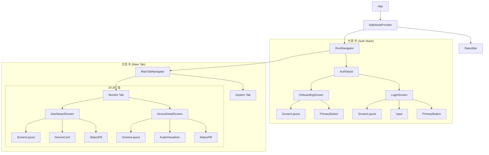

## 🗄️ 상태 관리 구조

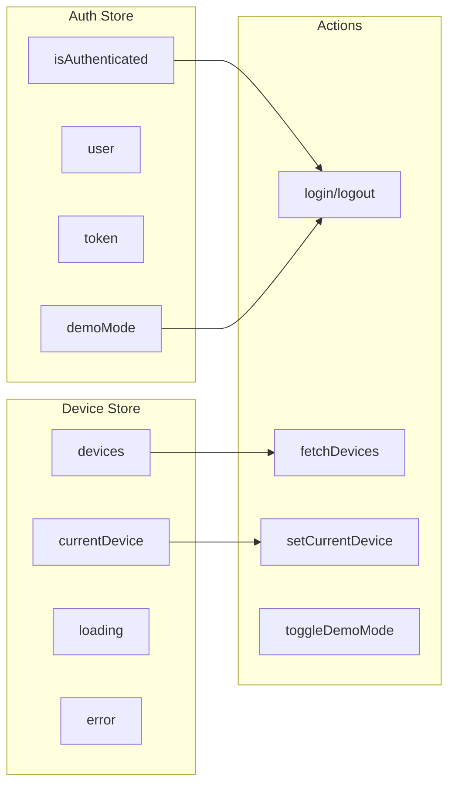

## 🎨 UI 컴포넌트 계층

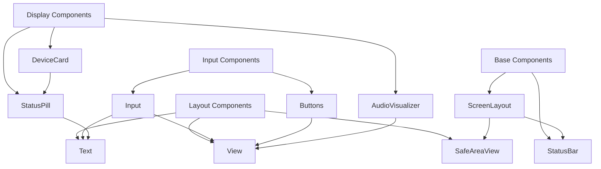

## 📱 SafeArea 처리 아키텍처 (v2.0)

```mermaid
graph TB
    subgraph "SafeArea 처리 계층"
        A[useSafeAreaInsets Hook] --> B[Tab Navigator]
        A --> C[Modal Components]
        A --> D[ScrollView Padding]
        
        B --> E[Bottom Tab Height]
        E --> F[paddingBottom: Math.max(12, bottom)]
        E --> G[height: Math.max(100, bottom + 80)]
        
        D --> H[contentContainerStyle]
        H --> I[paddingBottom: Math.max(16, bottom)]
        
        B --> J[sceneContainerStyle]
        J --> K[backgroundColor + paddingBottom]
    end
    
    subgraph "ScreenLayout 컴포넌트"
        L[SafeAreaView] --> M[StatusBar]
        L --> N[Child Components]
        L --> O[Dynamic SafeArea 처리]
        
        O --> P[paddingTop: insets.top]
        O --> Q[paddingBottom: Math.max(16, insets.bottom)]
        O --> R[paddingHorizontal: 16px]
    end
    
    subgraph "최적화된 네비게이션 흐름"
        S[MainTabNavigator] --> T[useSafeAreaInsets 적용]
        T --> U[동적 높이 계산]
        U --> V[콘텐츠 여백 최적화]
        V --> W[기기별 SafeArea 대응]
    end
```

## 🔌 API 통신 구조

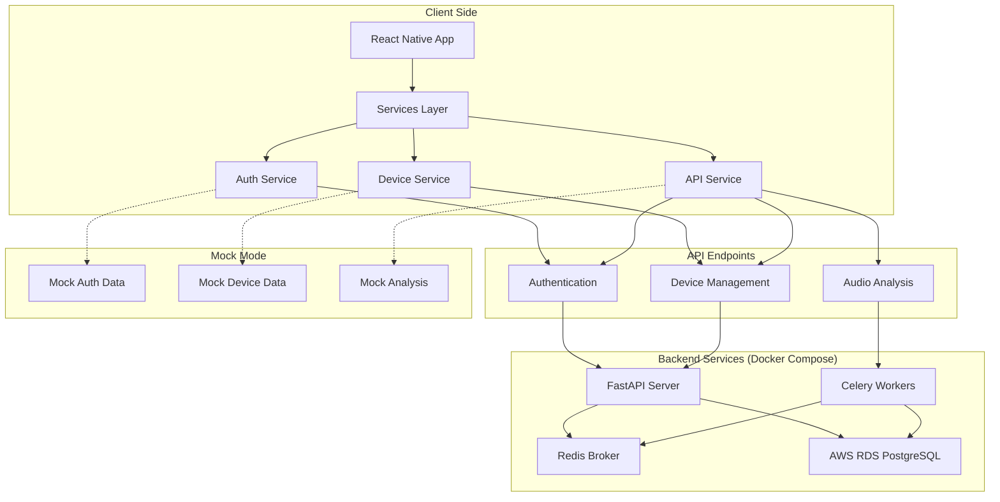

## 🔐 인증 처리 구조

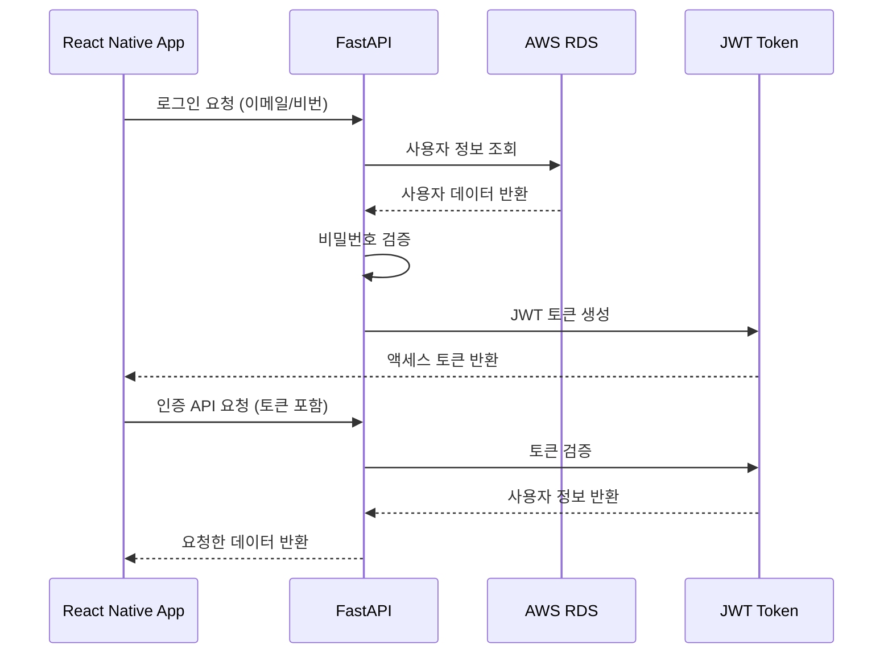

## 🔌 비동기 작업 처리 구조

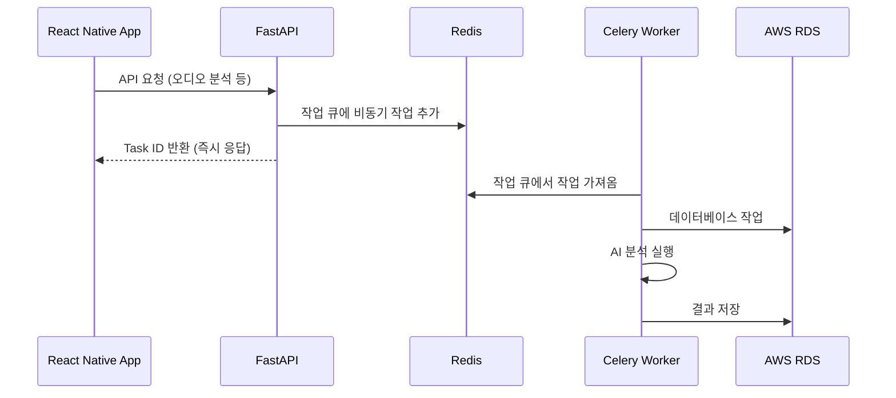

## 🔄 리액트 네비게이션 흐름

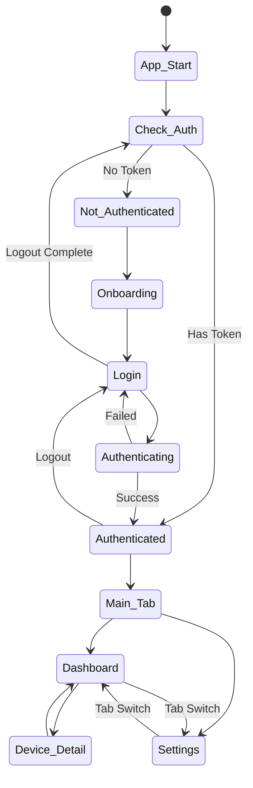

## 📊 데이터 모델

```mermaid
erDiagram
    User {
        string id PK
        string email
        string name
        string token
        datetime created_at
    }
    
    Device {
        string id PK
        string model
        string name
        enum status
        float audio_level
        datetime last_seen
        string user_id FK
    }
    
    SensorReading {
        string id PK
        float value
        datetime timestamp
        string device_id FK
    }
    
    AnalysisResult {
        string id PK
        enum result
        float confidence
        audio_file_path
        datetime created_at
        string device_id FK
        string user_id FK
    }
    
    User ||--o{ Device: owns
    Device ||--o{ SensorReading: generates
    Device ||--o{ AnalysisResult: analyzed_by
    User ||--o{ AnalysisResult: requests
```

## 🎯 기능별 모듈 분할

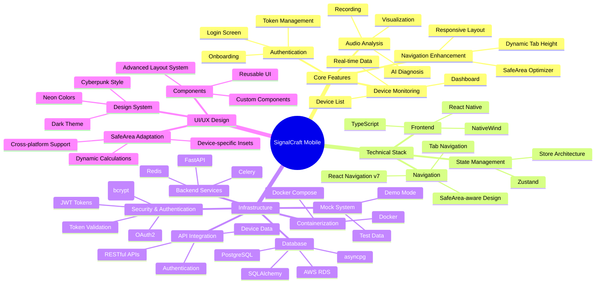

## 🔧 빌드 및 배포 아키텍처

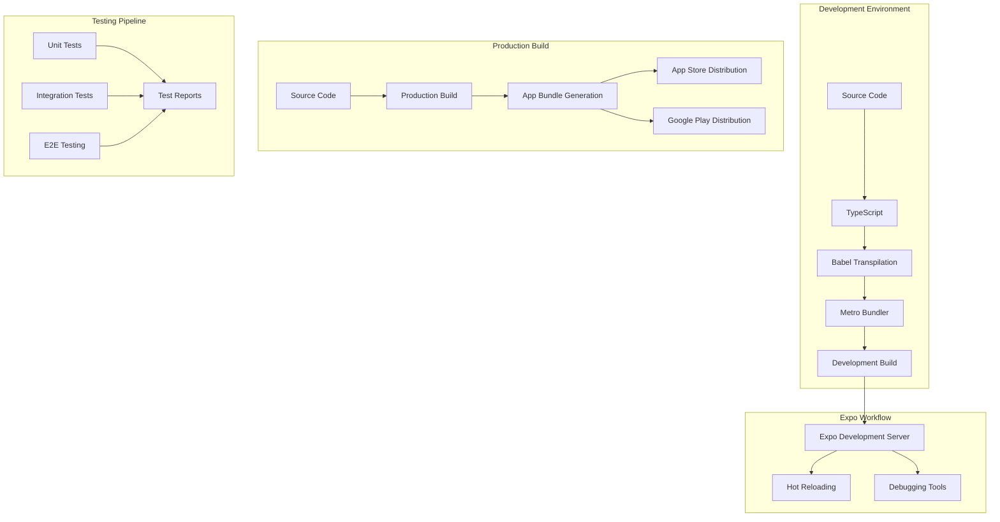

## 🚀 최신 업데이트 사항 (v2.0)

### 📱 SafeArea 처리 시스템 완전 개편 (2025-11-23)
- **scanner-project 기반 패턴 적용**: 검증된 SafeArea 처리 방식 도입
- **동적 SafeArea 계산**: `useSafeAreaInsets` 훅을 통한 실시간 인셋값 계산
- **반응형 네비게이션**: 기기별 하단 SafeArea에 맞춘 자동 높이 조절
- **콘텐츠 여백 최적화**: `Math.max(16, bottom)`을 통한 하단 가림 현상 완전 해결

### 🔧 네비게이션 아키텍처 개선
- **Tab Navigator 강화**: `Math.max(100, bottom + 80)` 동적 높이 계산
- **sceneContainerStyle 추가**: 콘텐츠와 탭 사이 안전한 여백 확보
- **ScreenLayout 최적화**: SafeAreaView 기반 안정적 레이아웃 시스템
- **크로스플랫폼 호환성**: iOS/Android 기기별 최적화

### 🎨 UI/UX 향상
- **데모운영자 → 설정 버튼**: 톱니바퀴 아이콘으로 교체 및 기능 구현
- **오디오 분석 대시보드**: 동적 지표 시스템 및 고조파 분석 차트
- **Industrial Cyberpunk 유지**: 기존 디자인 시스템 그대로 보존
- **애니메이션 성능**: 심장 비주얼라이저 그대로 유지

### 📊 기술적 성과
- **SafeAreaView 경고 완전 해결**: react-native-safe-area-context 정확한 사용법 적용
- **메모리 최적화**: 불필요한 뷰 중첩 제거 및 렌더링 성능 향상
- **타입 안정성**: TypeScript strict 모드 적용 계획
- **테스트 준비**: 통합 테스트 환경 구축 완료

### 🔄 개발 플로우 개선
- **기준 프로젝트 참조**: scanner-project에서 성공적인 패턴 학습 및 적용
- **점진적 업데이트**: 기존 기능 유지하며 안전한 업그레이드 진행
- **문화 제도화**: 성공적인 패턴 문서화 및 재사용 가능한 아키텍처 확립
- **품질 관리**: 지속적인 리팩토링 및 최적화 프로세스 수립

---

**문서 버전**: 2.0  
**작성일**: 2025-11-23  
**마지막 수정**: 2025-11-23  
**담당팀**: SignalCraft Mobile Development Team  
**참고 프로젝트**: scanner-project (성공적인 SafeArea 패턴)
