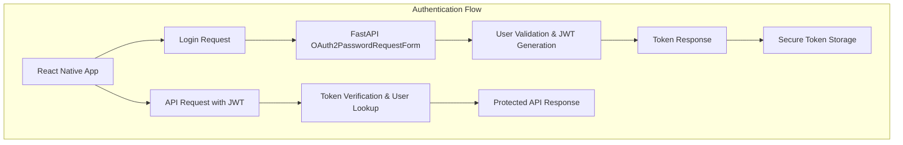

# SignalCraft Mobile - 아키텍처 구조도

## 🏗️ 전체 아키텍처

```mermaid
graph TB
    subgraph "Mobile App Layer"
        A[React Native App] --> B[Navigation System]
        A --> C[UI Components]
        A --> D[State Management]
        A --> E[Services Layer]
        A --> F[Hooks Layer]
    end

    subgraph "Navigation Structure"
        B --> G[RootNavigator]
        G --> H[AuthStack]
        G --> I[MainTabNavigator]
        I --> J[Monitor Tab]
        I --> K[Diagnosis Tab] // Updated (AR Based)
        I --> L[System Tab]
        H --> M[OnboardingScreen]
        H --> N[LoginScreen]
        J --> O[DashboardScreen]
        J --> P[DeviceDetailScreen]
        J --> P2[AddDeviceScreen] // Added: Admin Feature
        K --> Q[DiagnosisScreen] // Updated
    end

    subgraph "UI Components Layer"
        C --> R[ScreenLayout]
        C --> S[DeviceCard]
        C --> T[AudioVisualizer]
        C --> U[Common UI (Button, Input, Pill)]
        C --> V[AR Components] // Added
        V --> W[DiagnosisCamera]
        V --> X[AROverlay]
        V --> Y[TargetReticle]
        V --> Z[HoloTelemetry]
        V --> AA[TacticalTrigger]
        V --> AB[TargetPanel] // Added: Context Display
    end

    subgraph "State Management"
        D --> AB_Store[useAuthStore (isAdmin)] // Updated
        D --> AC[useDeviceStore (isLoading, error, devices)] // Updated
        D --> AD[useDiagnosisLogic (Hook State, deviceId)] // Updated
    end

    subgraph "Services Layer"
        E --> AE[API Service]
        E --> AF[Auth Service]
        E --> AG[Device Service (Backend Only)]
        E --> AH[Analysis Service]
    end
```

## 🏗️ 인프라 아키텍처 (Docker Compose 기반)

```mermaid
graph TB
    subgraph "Remote Server (Production Environment)"
        A[FastAPI Backend]
        B[Redis Broker]
        C[Celery Workers]
        D[PostgreSQL DB]
        R2[Cloudflare R2 Object Storage] // Updated: Remote Storage
        
        A --> B
        C --> B
        A --> D
        C --> D
        A -- Upload/Delete --> R2
        C -- Download --> R2
    end

    subgraph "Client Side"
        E[Mobile App (Release APK)]
        F[Developer PC]
    end

    subgraph "Network & Security"
        G[Firewall (UFW)]
        H[SSH Tunnel (Optional)]
    end

    E -- HTTP/8000 --> G
    G --> A
    F -- SSH/22 --> G
    F -- Tunnel/5432 --> H
    H --> D
```

### 🚀 배포 및 릴리스 프로세스 (Deployment Workflow)

1.  **원격 서버 배포 (Remote Deployment)**:
    *   **Docker Compose V2**: 최신 Docker Compose V2를 사용하여 `backend`, `worker`, `redis` 컨테이너를 오케스트레이션합니다.
    *   **PostgreSQL**: Docker 컨테이너가 아닌 호스트(또는 별도 컨테이너)의 DB를 사용하며, `pg_hba.conf` 설정을 통해 외부 접속을 허용합니다.
    *   **Cloudflare R2 Storage**: 로컬 파일 시스템 대신 S3 호환 Cloudflare R2 스토리지를 사용하여 오디오 파일을 저장합니다.
    *   **Localization & Encoding**: `docker-compose.yml`에 `LANG=C.UTF-8`, `LC_ALL=C.UTF-8`을 설정하여 한글 데이터 처리를 완벽하게 지원합니다.
    *   **Automatic Schema Migration**: `main.py`의 `startup_event`에서 `location` 등 필수 컬럼의 존재 여부를 확인하고 자동으로 추가합니다.

2.  **모바일 앱 릴리스 (Release Build)**:
    *   **Environment**: `.env` 파일을 통해 Production API URL(`http://3.39.x.x:8000`)을 주입합니다.
    *   **Admin Features**: 관리자 권한(`isAdmin`)에 따라 UI가 동적으로 변경됩니다 (장비 추가 버튼 등).

## 🔐 인증 아키텍처 (JWT 기반)



## 🎯 기능별 모듈 분할 (Updated)

```mermaid
mindmap
  root((SignalCraft Mobile))
    Core Features
      Authentication
        Login Screen
        Token Management
        Role-Based Access (Admin/User) // Added
      Device Management (New)
        Device List (Dashboard)
        Add Device (Admin Only)
        Delete Device (Admin Only) // Added
        Device Detail
      AR Diagnosis (Phase C+)
        AR HUD System
        Context-based Permission
        Recording Pipeline (WAV/M4A Dual Stack)
        Target Context (TargetPanel) // Added
        Analysis Result Visualization
    Technical Stack
      Frontend
        React Native
        Expo Camera / AV
        Reanimated / SVG
      Backend
        FastAPI
        Celery / Redis
        PostgreSQL
        FFmpeg / Librosa
        Cloudflare R2 (S3)
    Infrastructure
      Docker Compose
      AWS RDS
```