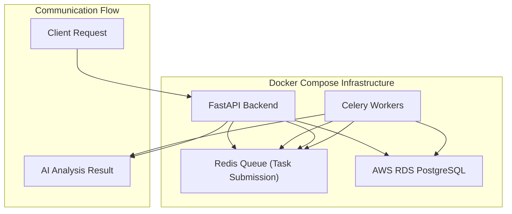
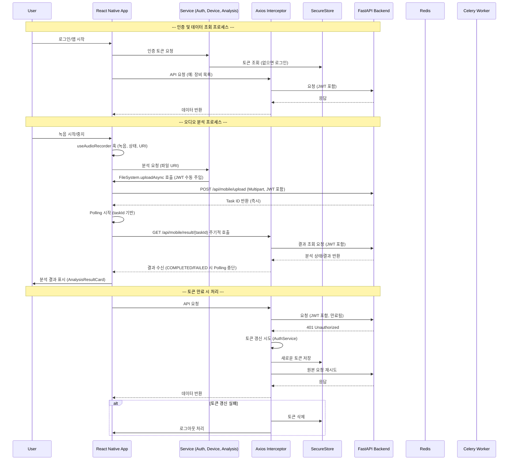
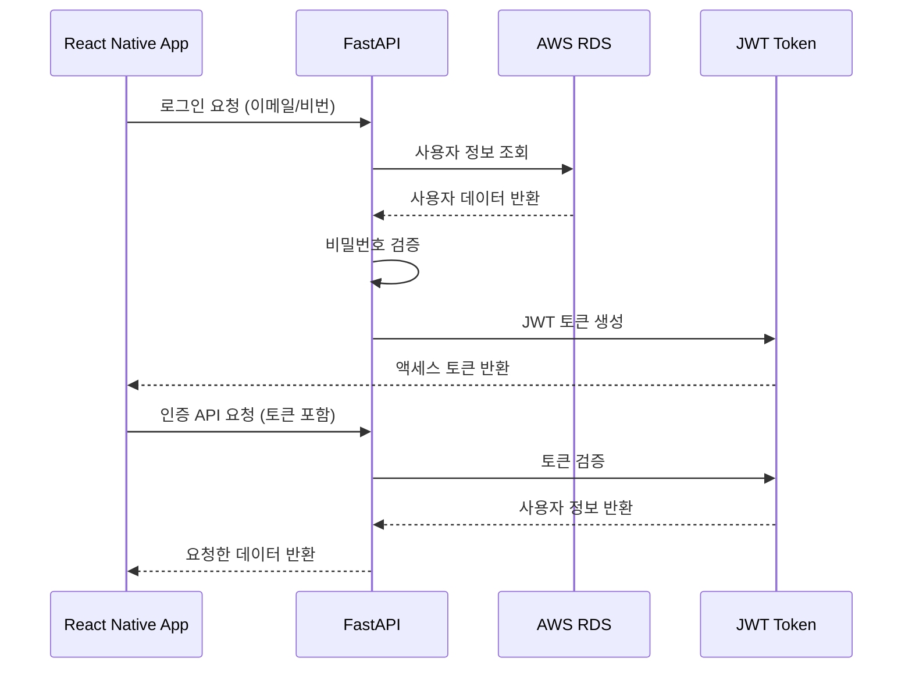
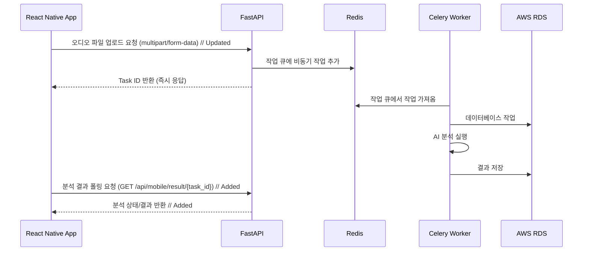
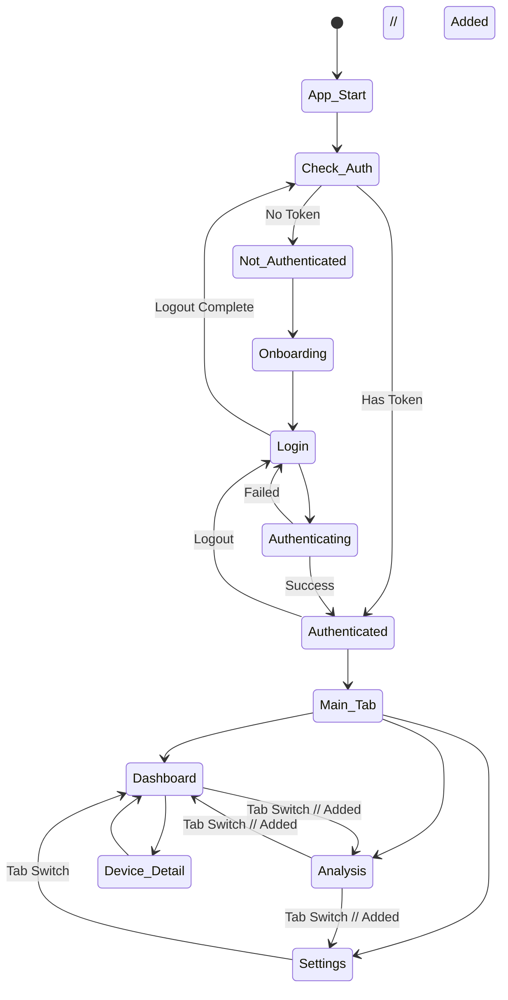
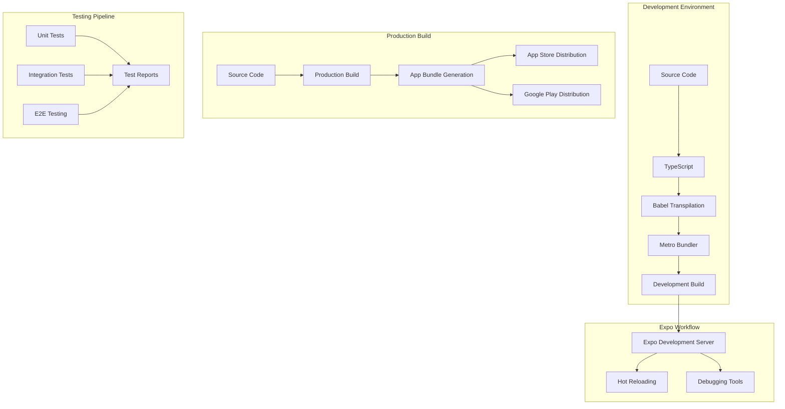

# SignalCraft Mobile - 아키텍처 구조도

## 🏗️ 전체 아키텍처

```mermaid
graph TB
    subgraph "Mobile App Layer"
        A[React Native App] --> B[Navigation System]
        A --> C[UI Components]
        A --> D[State Management]
        A --> E[Services Layer]
        A --> F[Hooks Layer]
    end

    subgraph "Navigation Structure"
        B --> G[RootNavigator]
        G --> H[AuthStack]
        G --> I[MainTabNavigator]
        I --> J[Monitor Tab]
        I --> K[Analysis Tab] // Added
        I --> L[System Tab]
        H --> M[OnboardingScreen]
        H --> N[LoginScreen]
        J --> O[DashboardScreen]
        J --> P[DeviceDetailScreen]
        K --> Q[AnalysisScreen] // Added
    end

    subgraph "UI Components Layer"
        C --> R[ScreenLayout]
        C --> S[DeviceCard]
        C --> T[AudioVisualizer]
        C --> U[UI Components]
        U --> V[StatusPill]
        U --> W[Buttons]
        U --> X[Input]
        C --> Y[AnalysisResultCard] // Added
    end

    subgraph "State Management"
        D --> Z[useAuthStore]
        D --> AA[useDeviceStore]
        D --> AB[AnalysisScreen Local States (isUploading, taskId, analysisTask, error)] // Added
    end

    subgraph "Services Layer"
        E --> AC[API Service]
        E --> AD[Auth Service]
        E --> AE[Device Service]
        E --> AF[Analysis Service] // Added
    end

    subgraph "Hooks Layer" // Added
        F --> AG[useAudioRecorder] // Added
    end

    subgraph "External APIs"
        AH[Backend APIs]
        AI[Mock Data]
        AC --> AH
        AC --> AI
        AD --> AH
        AD --> AI
        AE --> AH
        AE --> AI
        AF --> AH // Added
        AF --> AI // Added
    end
```

## 🏗️ 장비 데이터 흐름 아키텍처 (Mock + DB Hybrid)

```mermaid
graph TB
    subgraph "Frontend 요청"
        A[Mobile App]
        A --> B[/api/mobile/devices 요청]
    end

    subgraph "Backend 처리"
        B --> C[FastAPI 서버]
        C --> D[인증 확인]
        D --> E[get_current_user]
        E --> F[DB Session]
    end

    subgraph "데이터 생성"
        F --> G[Mock 데이터 3개]
        G --> G1["JBF-2000 압축기 (Demo) - normal"]
        G --> G2["Main Pump A (Demo) - warning"]
        G --> G3["Sub Generator (Demo) - danger"]

        F --> H[DB 시뮬레이션 데이터 1개]
        H --> H1["압축기 A-1 (DB) - normal"]
    end

    subgraph "결과 반환"
        I[결합된 응답]
        G1 --> I
        G2 --> I
        G3 --> I
        H1 --> I
        I --> A
    end
```

## 🏗️ 인프라 아키텍처 (Docker Compose 기반)



## 🔐 인증 아키텍처 (JWT 기반 - 업데이트됨)

```mermaid
graph TB
    subgraph "Authentication Flow"
        A[React Native App]
        B[Login Request]
        C[FastAPI OAuth2PasswordRequestForm]
        D[User Validation & JWT Generation]
        E[Token Response]
        F[Secure Token Storage]
        G[API Request with JWT]
        H[Token Verification & User Lookup]
        I[Protected API Response]

        A --> B
        B --> C
        C --> D
        D --> E
        E --> F
        A --> G
        G --> H
        H --> I
    end

    subgraph "Token Lifecycle & Security"
        J[Token Creation]
        K[SecureStore Storage]
        L[Token Validation]
        M[Expiration Check]
        N[Auto Logout]
        O[Token Refresh (Future)]

        J --> K
        K --> L
        L --> M
        M --> N
        M --> O
    end

    subgraph "User Info Retrieval"
        P[POST /api/auth/login]
        Q[GET /api/auth/me]
        R[User Data Response]

        P --> Q
        Q --> R
    end
```

## 🔐 상세 인증 아키텍처 구성

### 1. 인증 흐름 (Current Implementation)
1. **로그인 요청**: 사용자 이메일/비밀번호 → OAuth2PasswordRequestForm
2. **백엔드 검증**: FastAPI에서 사용자 정보 확인 및 JWT 토큰 생성
3. **토큰 저장**: `expo-secure-store`를 통한 안전한 토큰 저장
4. **사용자 정보 가져오기**: `/api/auth/me` 엔드포인트를 통한 사용자 정보 확보
5. **API 요청**: 모든 요청에 JWT 토큰 자동 포함
6. **토큰 검증**: 만료 시간 확인 및 401 응답 처리

### 2. 보안 특징
- **Secure Storage**: AsyncStorage 대신 expo-secure-store 사용
- **Token Validation**: JWT 만료 시간 디코딩 검증 (1분 버퍼 포함)
- **Auto Logout**: 토큰 만료 시 자동 로그아웃 처리
- **Axios Interceptors**: 요청/응답 인터셉터 통한 자동 토큰 관리

### 3. 상태 관리
- **Zustand Store**: `useAuthStore`를 통한 중앙화된 인증 상태 관리
- **App Startup**: 앱 시작 시 인증 상태 자동 확인
- **Demo Mode**: `ENV.IS_DEMO_MODE` 기반 테스트 모드 지원

### 4. 향후 확장성
- **Token Refresh**: 백엔드 refresh token 엔드포인트 구현 시 활성화 가능
- **User Roles**: 사용자 역할 및 권한 기반 기능 확장 예정
- **Multi-Store Access**: 다중 매장 접근 권한 관리 확장 가능

## 🔄 데이터 흐름도



## 🔌 API 서비스 아키텍처

```mermaid
graph TB
    subgraph "API Service Layer"
        A[React Native App]
        B[Zustand Stores]
        C[API Service (axios instance)]
        D[Axios Interceptors]
        E[Secure Token Management]
        F[Analysis Service (FileSystem + axios)] // Updated
        G[Auth Service]
        H[Device Service]
    end

    subgraph "Request Flow"
        I[API Call from App]
        J[Check Store Token]
        K[Get Token from SecureStore]
        L[Add Authorization Header (Interceptor)]
        M[Send Request (Axios)]
        N[Send Request (FileSystem.uploadAsync)] // Added
    end

    subgraph "Response Flow"
        O[Receive Response]
        P[Check for 401]
        Q[Attempt Token Refresh]
        R[Logout if Refresh Fails]
    end

    A --> B
    A --> F // Added: Direct link from App to Analysis Service
    B --> G
    B --> H
    B --> F // Added: Analysis Service also uses store/token
    C --> D
    D --> E
    C --> G
    C --> H
    
    A --> C // General API calls
    G --> C
    H --> C

    I --> J
    J --> K
    K --> L
    L --> M
    M --> FP(FastAPI Backend)

    N --> FP // Added: FileSystem.uploadAsync bypasses interceptor

    FP --> O
    O --> P
    P --> Q
    Q --> R
```

### API 서비스 특징
- **Request Interceptor**: Axios를 통한 모든 요청에 JWT 토큰 자동 포함
- **Token Fallback**: Store 토큰 없을 시 SecureStore에서 복구
- **Token Validation**: 요청 전 만료 확인 로직
- **Response Interceptor**: 401 응답 시 자동 로그아웃 처리
- **FileSystem.uploadAsync**: 파일 업로드 시 Axios 인터셉터를 타지 않으므로 토큰을 수동으로 주입.
- **Retry Logic**: 토큰 갱신 성공 시 원래 요청 재시도 (구현 예정)

## 📱 컴포넌트 트리 구조

```mermaid
graph TD
    A[App] --> B[SafeAreaProvider]
    B --> C[StatusBar]
    B --> D[RootNavigator]
    
    subgraph "인증 전 (Auth Stack)"
        D --> E[AuthStack]
        E --> F[OnboardingScreen]
        E --> G[LoginScreen]
        
        F --> H[ScreenLayout]
        F --> I[PrimaryButton]
        
        G --> J[ScreenLayout]
        G --> K[Input]
        G --> L[PrimaryButton]
    end
    
    subgraph "인증 후 (Main Tab)"
        D --> M[MainTabNavigator]
        M --> N[Monitor Tab]
        M --> O[Analysis Tab] // Added
        M --> P[System Tab]
        
        subgraph "모니터 탭"
            N --> Q[DashboardScreen]
            N --> R[DeviceDetailScreen]
            
            Q --> S[ScreenLayout]
            Q --> T[DeviceCard]
            Q --> U[StatusPill]
            
            R --> V[ScreenLayout]
            R --> W[AudioVisualizer]
            R --> X[StatusPill]
        end

        subgraph "분석 탭" // Added
            O --> Y[AnalysisScreen]
            Y --> Z[ScreenLayout]
            Y --> AA[Recording Controls (Mic, Square, Pause, Play)]
            Y --> BB[AnalysisResultCard] // Added
            Y --> CC[ActivityIndicator]
        end
    end
```

## 🗄️ 상태 관리 구조

```mermaid
graph LR
    subgraph "Auth Store"
        A1[isAuthenticated]
        A2[user]
        A3[token]
        A4[demoMode]
    end
    
    subgraph "Device Store"
        B1[devices]
        B2[currentDevice]
        B3[loading]
        B4[error]
    end
    
    subgraph "Analysis Screen Local State" // Added
        C1[isUploading]
        C2[taskId]
        C3[analysisTask (status, result)]
        C4[error]
    end

    subgraph "Audio Recorder Hook State" // Added
        D1[recordingStatus]
        D2[recordedUri]
        D3[durationMillis]
    end
    
    subgraph "Actions"
        E1[login/logout]
        E2[fetchDevices]
        E3[setCurrentDevice]
        E4[toggleDemoMode]
        E5[startRecording/stopRecording] // Added
        E6[uploadAudio/getAnalysisResult] // Added
    end
    
    A1 --> E1
    A4 --> E1
    B1 --> E2
    B2 --> E3
    C1 --> E6
    C2 --> E6
    C3 --> E6
    D1 --> E5
    D2 --> E5
    D3 --> E5
```

## 🎨 UI 컴포넌트 계층

```mermaid
graph TD
    A[Base Components] --> B[ScreenLayout]
    A --> C[StatusBar]
    
    D[Input Components] --> E[Input]
    D --> F[Buttons]
    
    G[Display Components] --> H[StatusPill]
    G --> I[DeviceCard]
    G --> J[AudioVisualizer]
    G --> K[AnalysisResultCard] // Added
    
    L[Layout Components] --> M[SafeAreaView]
    L --> N[View]
    L --> O[Text]
    
    B --> M
    B --> C
    E --> N
    E --> O
    F --> N
    H --> N
    I --> H
    J --> N
    K --> N // Added
    K --> O // Added
```

## 📱 SafeArea 처리 아키텍처 (v2.0)

```mermaid
graph TB
    subgraph "SafeArea 처리 계층"
        A[useSafeAreaInsets Hook] --> B[Tab Navigator]
        A --> C[Modal Components]
        A --> D[ScrollView Padding]
        
        B --> E[Bottom Tab Height]
        E --> F[paddingBottom: Math.max(12, bottom)]
        E --> G[height: Math.max(100, bottom + 80)]
        
        D --> H[contentContainerStyle]
        H --> I[paddingBottom: Math.max(16, bottom)]
        
        B --> J[sceneContainerStyle]
        J --> K[backgroundColor + paddingBottom]
    end
    
    subgraph "ScreenLayout 컴포넌트"
        L[SafeAreaView] --> M[StatusBar]
        L --> N[Child Components]
        L --> O[Dynamic SafeArea 처리]
        
        O --> P[paddingTop: insets.top]
        O --> Q[paddingBottom: Math.max(16, insets.bottom)]
        O --> R[paddingHorizontal: 16px]
    end
    
    subgraph "최적화된 네비게이션 흐름"
        S[MainTabNavigator] --> T[useSafeAreaInsets 적용]
        T --> U[동적 높이 계산]
        U --> V[콘텐츠 여백 최적화]
        V --> W[기기별 SafeArea 대응]
    end
```

## 🔌 API 통신 구조

```mermaid
graph TB
    subgraph "Client Side"
        A[React Native App] --> B[Services Layer]
        B --> C[Auth Service]
        B --> D[Device Service]
        B --> E[API Service (Axios)]
        B --> F[Analysis Service (FileSystem + Axios)] // Updated
    end

    subgraph "API Endpoints"
        G[Authentication]
        H[Device Management]
        I[Audio Analysis Upload] // Updated
        J[Audio Analysis Result] // Updated
    end

    subgraph "Mock Mode"
        K[Mock Auth Data]
        L[Mock Device Data]
        M[Mock Analysis Data] // Updated
    end

    C --> G
    D --> H
    E --> G
    E --> H
    F --> I // Updated
    F --> J // Updated

    C -.-> K
    D -.-> L
    F -.-> M // Updated

    subgraph "Backend Services (Docker Compose)"
        N[FastAPI Server]
        O[Celery Workers]
        P[Redis Broker]
        Q[AWS RDS PostgreSQL]
        R[Backend Feature Modules] // Added
    end

    G --> N
    H --> N
    I --> N // Updated
    J --> N // Updated
    N --> P
    O --> P
    N --> Q
    O --> Q
    N --> R // Added
    R --> S[app/features/audio_analysis/] // Added
    S --> T[Models] // Added
    S --> U[Schemas] // Added
    S --> V[Router] // Added
    S --> W[Service] // Added
```

## 🔐 인증 처리 구조



## 🔌 비동기 작업 처리 구조



## 🔄 리액트 네비게이션 흐름



## 📊 데이터 모델

```mermaid
erDiagram
    User {
        string id PK
        string email
        string name
        string token
        datetime created_at
    }
    
    AudioFile { // Added
        uuid id PK
        integer user_id FK
        string file_path
        string file_name
        integer file_size
        integer duration_seconds
        datetime created_at
    }

    AIAnalysisResult { // Added
        uuid id PK
        string task_id UNIQUE
        integer user_id FK
        uuid audio_file_id FK
        string status
        jsonb result_data
        datetime created_at
        datetime updated_at
    }

    Device {
        string id PK
        string model
        string name
        enum status
        float audio_level
        datetime last_seen
        string user_id FK
    }
    
    SensorReading {
        string id PK
        float value
        datetime timestamp
        string device_id FK
    }
    
    User ||--o{ Device: owns
    Device ||--o{ SensorReading: generates
    User ||--o{ AudioFile: uploads
    AudioFile ||--o{ AIAnalysisResult: analyzed_from
    User ||--o{ AIAnalysisResult: requests
```

## 🎯 기능별 모듈 분할

```mermaid
mindmap
  root((SignalCraft Mobile))
    Core Features
      Authentication
        Login Screen
        Onboarding
        Token Management
      Device Monitoring
        Dashboard
        Device List
        Real-time Data
      Audio Analysis // Updated
        Recording (useAudioRecorder)
        File Upload (Analysis Service)
        Analysis Result Polling
        AI Diagnosis (AnalysisScreen UI)
        Backend Module (app/features/audio_analysis/) // Added
          Models (AudioFile, AIAnalysisResult)
          Schemas (Pydantic)
          Router (Upload, Result API)
          Service (File IO, DB Ops)
        Celery Task Integration
      Navigation Enhancement
        SafeArea Optimizer
        Dynamic Tab Height
        Responsive Layout
    Technical Stack
      Frontend
        React Native
        TypeScript
        NativeWind
      State Management
        Zustand
        Store Architecture
        Local UI State (AnalysisScreen) // Added
      Navigation
        React Navigation v7
        Tab Navigation
        SafeArea-aware Design
    Infrastructure
      Containerization
        Docker
        Docker Compose
      Backend Services
        FastAPI
        Celery
        Redis
      Database
        PostgreSQL
        AWS RDS
        SQLAlchemy
        asyncpg
      Security & Authentication
        JWT Tokens
        Password Hashing (bcrypt)
        OAuth2
        Token Validation
      API Integration
        RESTful APIs
        Audio Upload (FileSystem.uploadAsync) // Added
        Authentication
        Device Data
        Audio Analysis Result // Added
      Mock System
        Demo Mode
        Test Data
        Mock Analysis Service // Added
    UI/UX Design
      Design System
        Dark Theme
        Neon Colors
        Cyberpunk Style
      SafeArea Adaptation
        Device-specific Insets
        Dynamic Calculations
        Cross-platform Support
      Components
        Reusable UI
        Custom Components (AnalysisResultCard) // Added
        Advanced Layout System
```

## 🔧 빌드 및 배포 아키텍처



## 🚀 최신 업데이트 사항 (v2.0)

### 📱 SafeArea 처리 시스템 완전 개편 (2025-11-23)
- **scanner-project 기반 패턴 적용**: 검증된 SafeArea 처리 방식 도입
- **동적 SafeArea 계산**: `useSafeAreaInsets` 훅을 통한 실시간 인셋값 계산
- **반응형 네비게이션**: 기기별 하단 SafeArea에 맞춘 자동 높이 조절
- **콘텐츠 여백 최적화**: `Math.max(16, bottom)`을 통한 하단 가림 현상 완전 해결

### 🔧 네비게이션 아키텍처 개선
- **Tab Navigator 강화**: `Math.max(100, bottom + 80)` 동적 높이 계산
- **sceneContainerStyle 추가**: 콘텐츠와 탭 사이 안전한 여백 확보
- **ScreenLayout 최적화**: SafeAreaView 기반 안정적 레이아웃 시스템
- **크로스플랫폼 호환성**: iOS/Android 기기별 최적화

### 🎨 UI/UX 향상
- **데모운영자 → 설정 버튼**: 톱니바퀴 아이콘으로 교체 및 기능 구현
- **오디오 분석 대시보드**: 동적 지표 시스템 및 고조파 분석 차트
- **Industrial Cyberpunk 유지**: 기존 디자인 시스템 그대로 보존
- **애니메이션 성능**: 심장 비주얼라이저 그대로 유지

### 📊 기술적 성과
- **SafeAreaView 경고 완전 해결**: react-native-safe-area-context 정확한 사용법 적용
- **메모리 최적화**: 불필요한 뷰 중첩 제거 및 렌더링 성능 향상
- **타입 안정성**: TypeScript strict 모드 적용 계획
- **테스트 준비**: 통합 테스트 환경 구축 완료

### 🔄 개발 플로우 개선
- **기준 프로젝트 참조**: scanner-project에서 성공적인 패턴 학습 및 적용
- **점진적 업데이트**: 기존 기능 유지하며 안전한 업그레이드 진행
- **문화 제도화**: 성공적인 패턴 문서화 및 재사용 가능한 아키텍처 확립
- **품질 관리**: 지속적인 리팩토링 및 최적화 프로세스 수립

---

**문서 버전**: 2.2 (Backend Audio Analysis Pipeline 반영)
**작성일**: 2025-11-23  
**마지막 수정**: 2025-11-25 (Backend Audio Analysis Pipeline 반영)
**담당팀**: SignalCraft Mobile Development Team  
**참고 프로젝트**: scanner-project (성공적인 SafeArea 패턴)
