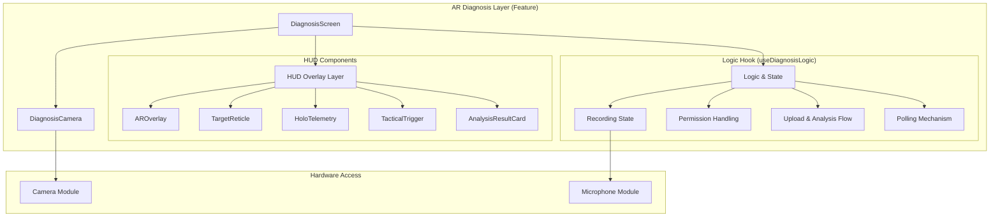
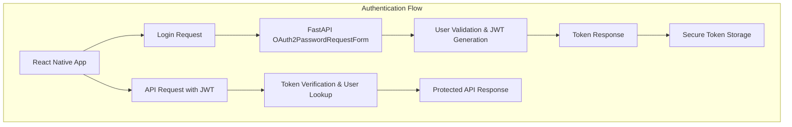
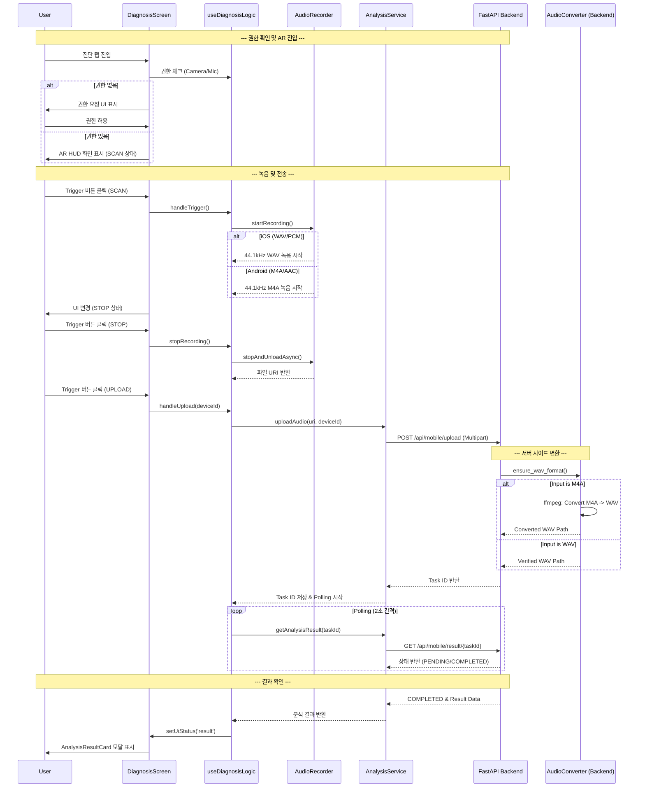

# SignalCraft Mobile - 아키텍처 구조도

## 🏗️ 전체 아키텍처

```mermaid
graph TB
    subgraph "Mobile App Layer"
        A[React Native App] --> B[Navigation System]
        A --> C[UI Components]
        A --> D[State Management]
        A --> E[Services Layer]
        A --> F[Hooks Layer]
    end

    subgraph "Navigation Structure"
        B --> G[RootNavigator]
        G --> H[AuthStack]
        G --> I[MainTabNavigator]
        I --> J[Monitor Tab]
        I --> K[Diagnosis Tab] // Updated (AR Based)
        I --> L[System Tab]
        H --> M[OnboardingScreen]
        H --> N[LoginScreen]
        J --> O[DashboardScreen]
        J --> P[DeviceDetailScreen]
        K --> Q[DiagnosisScreen] // Updated
    end

    subgraph "UI Components Layer"
        C --> R[ScreenLayout]
        C --> S[DeviceCard]
        C --> T[AudioVisualizer]
        C --> U[Common UI (Button, Input, Pill)]
        C --> V[AR Components] // Added
        V --> W[DiagnosisCamera]
        V --> X[AROverlay]
        V --> Y[TargetReticle]
        V --> Z[HoloTelemetry]
        V --> AA[TacticalTrigger]
    end

    subgraph "State Management"
        D --> AB[useAuthStore]
        D --> AC[useDeviceStore (isLoading, error, devices)] // Updated
        D --> AD[useDiagnosisLogic (Hook State, deviceId)] // Updated
    end

    subgraph "Services Layer"
        E --> AE[API Service]
        E --> AF[Auth Service]
        E --> AG[Device Service]
        E --> AH[Analysis Service]
    end
```

## 🏗️ AR 오디오 진단 시스템 (Phase C+)



## 🏗️ 인프라 아키텍처 (Docker Compose 기반)

```mermaid
graph TB
    subgraph "Remote Server (Production Environment)"
        A[FastAPI Backend]
        B[Redis Broker]
        C[Celery Workers]
        D[PostgreSQL DB]
        
        A --> B
        C --> B
        A --> D
        C --> D
    end

    subgraph "Client Side"
        E[Mobile App (Release APK)]
        F[Developer PC]
    end

    subgraph "Network & Security"
        G[Firewall (UFW)]
        H[SSH Tunnel (Optional)]
    end

    E -- HTTP/8000 --> G
    G --> A
    F -- SSH/22 --> G
    F -- Tunnel/5432 --> H
    H --> D
```

### 🚀 배포 및 릴리스 프로세스 (Deployment Workflow)

1.  **원격 서버 배포 (Remote Deployment)**:
    *   **Docker Compose V2**: 최신 Docker Compose V2를 사용하여 `backend`, `worker`, `redis` 컨테이너를 오케스트레이션합니다. (Legacy v1은 호환성 문제로 사용하지 않음)
    *   **PostgreSQL**: Docker 컨테이너가 아닌 호스트(또는 별도 컨테이너)의 DB를 사용하며, `pg_hba.conf` 설정을 통해 외부(Docker 네트워크 및 개발자 PC) 접속을 허용합니다.
    *   **Data Seeding**: `main.py` 시작 시 초기 사용자 및 데모 장비 데이터를 자동으로 시딩하며, 비밀번호는 안전한 `bcrypt` 해시로 저장됩니다.

2.  **모바일 앱 릴리스 (Release Build)**:
    *   **Environment**: `.env` 파일을 통해 Production API URL(`http://3.39.x.x:8000`)을 주입합니다.
    *   **Network Security**: `AndroidManifest.xml`의 `usesCleartextTraffic="true"` 설정을 통해 HTTP 통신을 지원합니다.
    *   **Build**: Gradle(`assembleRelease`)을 사용하여 최적화된 서명된 APK를 생성합니다.

## 🔐 인증 아키텍처 (JWT 기반)



## 🔄 데이터 흐름도 (AR 진단 프로세스 - WAV Pipeline 적용)



## 🎯 기능별 모듈 분할 (Updated)

```mermaid
mindmap
  root((SignalCraft Mobile))
    Core Features
      Authentication
        Login Screen
        Token Management
      Device Monitoring
        Dashboard
        Real-time Data
      AR Diagnosis (Phase C+)
        AR HUD System
        Context-based Permission
        Recording Pipeline (WAV/M4A Dual Stack) // Updated
        Analysis Result Visualization
        Feature-based Architecture (src/features/diagnosis)
    Technical Stack
      Frontend
        React Native
        Expo Camera / AV
        Reanimated / SVG
      Backend
        FastAPI
        Celery / Redis
        PostgreSQL
        FFmpeg / Librosa // Added
    Infrastructure
      Docker Compose
      AWS RDS
```

### 🚀 최신 업데이트 사항 (v3.0 - WAV & High Freq)

### 🧠 Diagnostic Intelligence & Visualization Engine (Phase E / E-2)
- **모바일 AI 분석 파이프라인 구현 및 하이브리드 모드 지원 (완료)**:
    - **프론트엔드**: `useDiagnosisLogic` 훅을 통해 `ENV.IS_DEMO_MODE` 및 `deviceId` 접두사 (`MOCK-`)를 기반으로 **모의(Mock) API**와 **실제 백엔드 API** 호출을 지능적으로 전환하는 하이브리드 모드 로직을 구현 (업로드 및 결과 폴링).
    - **백엔드 처리 (`FastAPI` & `Celery`)**:
        - 모바일 앱에서 업로드된 오디오 파일 (`M4A`/`WAV`)은 `router.py`를 통해 수신됩니다.
        - `AudioConverter` (`converter.py`)를 통해 모든 오디오 파일은 AI 분석에 최적화된 **WAV 포맷으로 표준화**됩니다.
        - **AI 분석 엔진 고도화 (Hybrid ML - 완료)**:
            - **Isolation Forest 모델**: MIMII 데이터셋(1,006개 샘플) 기반으로 학습된 비지도 학습 모델을 사용하여 `anomaly_score`를 산출, 데이터의 이상 유무를 정밀하게 판별합니다.
            - **Envelope Analysis (포락선 분석)**: 베어링 결함 특화 로직으로, Bandpass Filter(2k-10k)와 Hilbert Transform을 통해 기계적 충격(Peak Frequencies)을 탐지합니다.
            - **Feature Extraction**: MFCC, Spectral Centroid, Zero Crossing Rate 등 34가지 고차원 음향 특징을 추출하여 분석에 활용합니다.
        - 분석 결과는 `AIAnalysisResult` 모델을 통해 데이터베이스에 저장되며, 상세 지표 (`details`)도 함께 기록됩니다.
    - **리포트 데이터 매핑 및 시각화**:
        - `AnalysisService` (`service.py`)는 `analyzer.py`가 생성한 `ML Anomaly Score`, `Peak Frequencies`, `RMS Level`, `Resonance` 등 실제 음향 지표를 프론트엔드의 `EnsembleRadar` 차트가 이해할 수 있는 구조로 **정확하게 매핑**합니다.
        - 시스템은 이제 실제 오디오 데이터에 기반한 AI 분석 결과(예: `CRITICAL` 상태 및 구체적인 지표 스코어)를 완벽하게 시각적으로 제공합니다.

### 📱 AI Model Calibration Strategy (Smartphone Adaptation)
MIMII 데이터셋(고성능 산업용 마이크)과 실제 스마트폰 마이크 간의 **도메인 차이(Domain Shift)**로 인한 과민 반응(False Positive)을 해결하기 위한 전략입니다.

1.  **현장 데이터 수집 (Data Collection)**:
    *   다양한 스마트폰 기종으로 실제 "정상(Normal)" 장비 소음을 녹음하여 학습 데이터셋에 추가합니다.
    *   생활 소음(배경 잡음)이 섞인 데이터를 포함하여 모델의 강건성(Robustness)을 높입니다.
2.  **모델 재학습 및 파인 튜닝 (Retraining & Fine-tuning)**:
    *   수집된 스마트폰 데이터를 기존 MIMII 데이터와 혼합하여 `Isolation Forest` 모델을 재학습시킵니다.
    *   이를 통해 모델이 스마트폰 마이크의 주파수 응답 특성을 "정상 범주"로 인식하게 합니다.
3.  **동적 임계값 조정 (Dynamic Thresholding)**:
    *   `analyzer.py`의 `score` 산출 로직을 개선하여, 스마트폰 환경에서의 기본 노이즈 레벨을 고려한 가중치를 적용합니다.
    *   짧은 녹음 시간(3초 미만)으로 인한 분석 오차를 줄이기 위해 최소 녹음 시간(5초 이상)을 UI 레벨에서 유도합니다.

- **Extended Data Model (XAI & Action)**:
    - 단순 상태 판정을 넘어 **설명 가능한 AI(XAI)** 데이터(`root_cause`, `confidence`) 제공.
    - 현장 엔지니어를 위한 **실행 가능한 가이드(Actionable Intelligence)** 데이터(`immediate_action`, `recommended_parts`, `estimated_downtime`) 통합.
- **Advanced SVG Visualization**:
    - **Baseline Comparison**: Radar Chart에 정상 범주(Gray Polygon)를 오버레이하여 이상 편차 시각화.
    - **Harmonic Analysis**: Spectrum Chart에 고장 주파수(1x, 2x RPM) 커서 및 그라데이션 적용.
    - **Predictive Analytics**: Trend Chart에 신뢰 구간(Confidence Interval) 및 고장 임계치(Threshold) 시각화.

### 🏠 Dashboard & Detail Modernization (Phase F)
- **Feature-Based Module (`src/features/device_detail`)**:
    - `DeviceDetailScreen`과 관련된 모든 UI/로직을 `src/features/device_detail` 폴더로 이동 및 모듈화.
    - `DemoControlPanel` 컴포넌트를 분리하여 재사용성 증대.
- **`DeviceDetailScreen` 아키텍처 개선**:
    - 기존의 Mock 데이터 및 UI를 제거하고, `AnalysisService`를 통해 `DetailedAnalysisReport`를 가져오도록 데이터 소스 통합.
    - `DiagnosisReportView`의 탭 컴포넌트(`OverviewTab`, `DetailAnalysisTab`, `PredictionTab`)를 재사용하여 Palantir 스타일 리포트 UI 적용.
    - `DemoControlPanel`을 화면 하단에 토글 가능한 바텀 시트 형태로 배치하여 사용자 경험 향상.
- **네비게이션 업데이트**: `MainNavigator`에서 `DeviceDetailScreen` 경로를 새로운 모듈 경로로 업데이트.

### 🛠️ 안정화 및 최적화 (Phase G)
- **데이터 흐름 무결성 강화**:
    - `Dashboard` (장비 선택) -> `Store` (selectedDevice) -> `DiagnosisScreen` (device_id) -> `Backend` (Analysis) -> `DB` (Result) -> `Dashboard` (Last Reading) 로 이어지는 전체 데이터 파이프라인의 연결 고리를 검증하고 수정했습니다.
    - 특히 `DiagnosisScreen`이 라우트 파라미터 대신 전역 스토어(`useDeviceStore`)를 참조하도록 변경하여 탭 간 이동 시에도 장비 컨텍스트가 유지되도록 개선했습니다.
- **타임스탬프 동기화**:
    - 백엔드 Worker가 분석 완료 시점(`completed_at`)을 UTC 기준으로 정확히 기록하고, 대시보드 조회 시 이를 반영하여 "방금 전", "X분 전" 등의 상대 시간이 정확히 표시되도록 했습니다.

### 🔊 WAV Audio Pipeline & Platform Optimization (Phase D-2)
- **Platform-Specific Recording Configuration**:
    - **Android**: `M4A (AAC)` + `44.1kHz` (High Frequency Capture for 10k+ analysis).
    - **iOS**: `WAV (PCM)` + `44.1kHz` (Lossless quality).
- **Backend Conversion Pipeline**:
    - **Automatic Format Standardization**: `AudioConverter` 모듈이 업로드된 M4A 파일을 서버 내부에서 고품질 WAV(`44.1kHz`)로 자동 변환.
    - **Infrastructure**: Docker 컨테이너에 `ffmpeg` 및 Python 변환 라이브러리(`pydub`, `ffmpeg-python`) 통합.

---

**문서 버전**: 3.0 (WAV Pipeline & High Frequency Update)
**작성일**: 2025-11-23
**마지막 수정**: 2025-11-29 (Phase E - AI 분석 파이프라인 구현 및 검증 완료)
**담당팀**: SignalCraft Mobile Development Team
