# SignalCraft Mobile - 아키텍처 구조도

## 🏗️ 전체 아키텍처

```mermaid
graph TB
    subgraph "Mobile App Layer"
        A[React Native App] --> B[Navigation System]
        A --> C[UI Components]
        A --> D[State Management]
        A --> E[Services Layer]
        A --> F[Hooks Layer]
    end

    subgraph "Navigation Structure"
        B --> G[RootNavigator]
        G --> H[AuthStack]
        G --> I[MainTabNavigator]
        I --> J[Monitor Tab]
        I --> K[Diagnosis Tab] // Updated (AR Based)
        I --> L[System Tab]
        H --> M[OnboardingScreen]
        H --> N[LoginScreen]
        J --> O[DashboardScreen]
        J --> P[DeviceDetailScreen]
        K --> Q[DiagnosisScreen] // Updated
    end

    subgraph "UI Components Layer"
        C --> R[ScreenLayout]
        C --> S[DeviceCard]
        C --> T[AudioVisualizer]
        C --> U[Common UI (Button, Input, Pill)]
        C --> V[AR Components] // Added
        V --> W[DiagnosisCamera]
        V --> X[AROverlay]
        V --> Y[TargetReticle]
        V --> Z[HoloTelemetry]
        V --> AA[TacticalTrigger]
    end

    subgraph "State Management"
        D --> AB[useAuthStore]
        D --> AC[useDeviceStore (isLoading, error, devices)] // Updated
        D --> AD[useDiagnosisLogic (Hook State, deviceId)] // Updated
    end

    subgraph "Services Layer"
        E --> AE[API Service]
        E --> AF[Auth Service]
        E --> AG[Device Service]
        E --> AH[Analysis Service]
    end
```

## 🏗️ AR 오디오 진단 시스템 (Phase C+)


## 🏗️ 인프라 아키텍처 (Docker Compose 기반)


## 🔐 인증 아키텍처 (JWT 기반)


## 🔄 데이터 흐름도 (AR 진단 프로세스 - WAV Pipeline 적용)

```mermaid
sequenceDiagram
    participant U as User
    participant RN as DiagnosisScreen
    participant HK as useDiagnosisLogic
    participant RC as AudioRecorder
    participant SV as AnalysisService
    participant FP as FastAPI Backend
    participant CV as AudioConverter (Backend)

    Note over U,FP: --- 권한 확인 및 AR 진입 ---
    U->>RN: 진단 탭 진입
    RN->>HK: 권한 체크 (Camera/Mic)
    alt 권한 없음
        RN->>U: 권한 요청 UI 표시
        U->>RN: 권한 허용
    else 권한 있음
        RN->>U: AR HUD 화면 표시 (SCAN 상태)
    end

    Note over U,FP: --- 녹음 및 전송 ---
    U->>RN: Trigger 버튼 클릭 (SCAN)
    RN->>HK: handleTrigger()
    HK->>RC: startRecording()
    
    alt iOS (WAV/PCM)
        RC-->>HK: 44.1kHz WAV 녹음 시작
    else Android (M4A/AAC)
        RC-->>HK: 44.1kHz M4A 녹음 시작
    end

    RN->>U: UI 변경 (STOP 상태)

    U->>RN: Trigger 버튼 클릭 (STOP)
    RN->>HK: stopRecording()
    HK->>RC: stopAndUnloadAsync()
    RC-->>HK: 파일 URI 반환
    
    U->>RN: Trigger 버튼 클릭 (UPLOAD)
    RN->>HK: handleUpload(deviceId)
    HK->>SV: uploadAudio(uri, deviceId)
    
    SV->>FP: POST /api/mobile/upload (Multipart)
    
    Note over FP,CV: --- 서버 사이드 변환 ---
    FP->>CV: ensure_wav_format()
    alt Input is M4A
        CV->>CV: ffmpeg: Convert M4A -> WAV
        CV-->>FP: Converted WAV Path
    else Input is WAV
        CV-->>FP: Verified WAV Path
    end
    
    FP-->>SV: Task ID 반환
    SV-->>HK: Task ID 저장 & Polling 시작
    
    loop Polling (2초 간격)
        HK->>SV: getAnalysisResult(taskId)
        SV->>FP: GET /api/mobile/result/{taskId}
        FP-->>SV: 상태 반환 (PENDING/COMPLETED)
    end

    Note over U,FP: --- 결과 확인 ---
    FP-->>SV: COMPLETED & Result Data
    SV-->>HK: 분석 결과 반환
    HK->>RN: setUiStatus('result')
    RN->>U: AnalysisResultCard 모달 표시
```



## 🎯 기능별 모듈 분할 (Updated)

```mermaid
mindmap
  root((SignalCraft Mobile))
    Core Features
      Authentication
        Login Screen
        Token Management
      Device Monitoring
        Dashboard
        Real-time Data
      AR Diagnosis (Phase C+)
        AR HUD System
        Context-based Permission
        Recording Pipeline (WAV/M4A Dual Stack) // Updated
        Analysis Result Visualization
        Feature-based Architecture (src/features/diagnosis)
    Technical Stack
      Frontend
        React Native
        Expo Camera / AV
        Reanimated / SVG
      Backend
        FastAPI
        Celery / Redis
        PostgreSQL
        FFmpeg / Librosa // Added
    Infrastructure
      Docker Compose
      AWS RDS
```

## 🚀 최신 업데이트 사항 (v3.0 - WAV & High Freq)

### 🛸 AR 오디오 진단 시스템 (Phase C+ 완료)
- **Terminator HUD UI**: 카메라 기반의 AR 뷰파인더와 홀로그래픽 오버레이 적용.
- **맥락 기반 권한 요청**: 진단 탭 진입 시점에 자연스럽게 카메라/마이크 권한을 요청하여 UX 개선.
- **Feature-based 구조**: `src/features/diagnosis`로 관련 기능을 모듈화하여 유지보수성 강화.
- **안정적인 녹음 파이프라인**: `setOnRecordingStatusUpdate`를 통한 정밀한 시간 측정 및 파일 관리.

### 🔧 백엔드 구조 개선 (Phase 3.2 - 데이터 연동 및 안정화)
- **Feature-based Backend**: `app/features/audio_analysis`로 오디오 분석 관련 로직(모델, 스키마, 라우터, 서비스)을 응집 **및 `Librosa` 기반 실시간 오디오 분석 로직 구현 완료.**
- **비동기 처리**: Celery를 이용한 Non-blocking 분석 요청 처리.
- **AsyncSession 호환성**: `get_current_user` 및 라우터 내 DB 접근 로직을 `AsyncSession`에 맞는 `await db.execute(select(...))` 및 `await db.flush()/commit()/rollback()` 방식으로 수정.
- **인증/인가 강화**: `app/security.py`에 `get_current_user` 함수를 구현하여 JWT 기반 사용자 인증 및 인가 처리.
- **API 경로 최적화**: `main.py`의 라우터 `prefix`와 `router.py` 내 엔드포인트 경로 중복 문제를 해결하여 `/api/mobile/upload` 등의 경로를 일치시킴.
- **DB 스키마 동기화**: `audio_files` 테이블에 `filename`, `device_id` 등 누락 컬럼 추가 및 `ai_analysis_results` 테이블의 `completed_at`, `device_id` 컬럼 동기화.

### 📱 프론트엔드 연동 강화 (Phase D - 데이터 동기화)
- **AR 진단 시 `deviceId` 전달**: `DiagnosisScreen`에서 `useDiagnosisLogic`을 통해 `AnalysisService`로 `deviceId`를 정확히 전달하여 백엔드와 연결.
- **대시보드 데이터 동기화**: `DashboardScreen`에 `useFocusEffect`를 적용하여 화면 포커스 시 최신 장비 데이터 조회.
- **분석 결과 UI 안정화**: `AnalysisResultCard.tsx`에서 백엔드 응답 데이터 구조에 맞춰 `toFixed` 호출 오류(`vibration` 필드 부재)를 수정.
- **네트워크 설정 유연화**: `.env` 및 `src/config/env.ts`에서 `EXPO_PUBLIC_API_BASE_URL` 환경 변수를 사용하여 백엔드 주소 관리.

### 🚀 Sales Demo Upgrade (Phase D+ - Palantir Style Analysis)
- **하이브리드 백엔드 아키텍처**: 
    - `app/features/audio_analysis/service.py`에서 `device_id` 접두사(`MOCK-`)를 기준으로 **Mock 시나리오 데이터**와 **실제 DB 데이터**를 분기 처리.
    - 실제 데이터가 부족한 경우에도 UI가 깨지지 않도록 안전한 기본값(Fallback) 구조 적용.
- **SVG 기반 커스텀 차트**:
    - `victory-native` 의존성을 제거하고 `react-native-svg`를 사용하여 `EnsembleRadar`, `FrequencySpectrum`, `PredictiveTrendChart`를 직접 구현.
    - 이를 통해 라이브러리 호환성 문제(`displayName` error)를 해결하고 렌더링 성능 최적화.
- **탭 기반 통합 리포트**:
    - `DiagnosisReportView`를 통해 **요약(Overview) - 상세(Detail) - 예측(Prediction)** 3단계 탭 구성.
    - NativeWind 기반 다크 테마(`#050505`) 디자인 시스템 적용.

### 🧠 Diagnostic Intelligence & Visualization Engine (Phase E / E-2)
- **Extended Data Model (XAI & Action)**:
    - 단순 상태 판정을 넘어 **설명 가능한 AI(XAI)** 데이터(`root_cause`, `confidence`) 제공.
    - 현장 엔지니어를 위한 **실행 가능한 가이드(Actionable Intelligence)** 데이터(`immediate_action`, `recommended_parts`, `estimated_downtime`) 통합.
- **Advanced SVG Visualization**:
    - **Baseline Comparison**: Radar Chart에 정상 범주(Gray Polygon)를 오버레이하여 이상 편차 시각화.
    - **Harmonic Analysis**: Spectrum Chart에 고장 주파수(1x, 2x RPM) 커서 및 그라데이션 적용.
    - **Predictive Analytics**: Trend Chart에 신뢰 구간(Confidence Interval) 및 고장 임계치(Threshold) 시각화.

### 🏠 Dashboard & Detail Modernization (Phase F)
- **Feature-Based Module (`src/features/device_detail`)**:
    - `DeviceDetailScreen`과 관련된 모든 UI/로직을 `src/features/device_detail` 폴더로 이동 및 모듈화.
    - `DemoControlPanel` 컴포넌트를 분리하여 재사용성 증대.
- **`DeviceDetailScreen` 아키텍처 개선**:
    - 기존의 Mock 데이터 및 UI를 제거하고, `AnalysisService`를 통해 `DetailedAnalysisReport`를 가져오도록 데이터 소스 통합.
    - `DiagnosisReportView`의 탭 컴포넌트(`OverviewTab`, `DetailAnalysisTab`, `PredictionTab`)를 재사용하여 Palantir 스타일 리포트 UI 적용.
    - `DemoControlPanel`을 화면 하단에 토글 가능한 바텀 시트 형태로 배치하여 사용자 경험 향상.
- **네비게이션 업데이트**: `MainNavigator`에서 `DeviceDetailScreen` 경로를 새로운 모듈 경로로 업데이트.

### 🛠️ 안정화 및 최적화 (Phase G)
- **데이터 흐름 무결성 강화**:
    - `Dashboard` (장비 선택) -> `Store` (selectedDevice) -> `DiagnosisScreen` (device_id) -> `Backend` (Analysis) -> `DB` (Result) -> `Dashboard` (Last Reading) 로 이어지는 전체 데이터 파이프라인의 연결 고리를 검증하고 수정했습니다.
    - 특히 `DiagnosisScreen`이 라우트 파라미터 대신 전역 스토어(`useDeviceStore`)를 참조하도록 변경하여 탭 간 이동 시에도 장비 컨텍스트가 유지되도록 개선했습니다.
- **타임스탬프 동기화**:
    - 백엔드 Worker가 분석 완료 시점(`completed_at`)을 UTC 기준으로 정확히 기록하고, 대시보드 조회 시 이를 반영하여 "방금 전", "X분 전" 등의 상대 시간이 정확히 표시되도록 했습니다.

### 🔊 WAV Audio Pipeline & Platform Optimization (Phase D-2)
- **Platform-Specific Recording Configuration**:
    - **Android**: `M4A (AAC)` + `44.1kHz` (High Frequency Capture for 10k+ analysis).
    - **iOS**: `WAV (PCM)` + `44.1kHz` (Lossless quality).
- **Backend Conversion Pipeline**:
    - **Automatic Format Standardization**: `AudioConverter` 모듈이 업로드된 M4A 파일을 서버 내부에서 고품질 WAV(`44.1kHz`)로 자동 변환.
    - **Infrastructure**: Docker 컨테이너에 `ffmpeg` 및 Python 변환 라이브러리(`pydub`, `ffmpeg-python`) 통합.

---

**문서 버전**: 3.0 (WAV Pipeline & High Frequency Update)
**작성일**: 2025-11-23
**마지막 수정**: 2025-11-29 (Phase D-2 완료)
**담당팀**: SignalCraft Mobile Development Team
